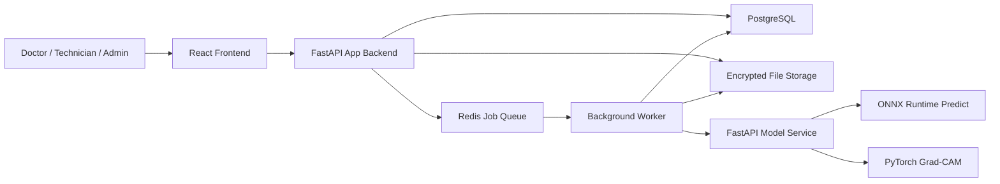

# App Design Reference - LungAI

## 1. Product Definition

The application is a secure clinical decision-support platform for chest X-ray analysis. It allows authorized medical users to upload radiology images, run an AI-assisted pulmonary screening model, review the prediction with confidence scores and Grad-CAM heatmaps, store the analysis history, and export structured PDF reports.

The platform must be treated as an assistant for medical review, not as an autonomous diagnostic authority. Final clinical interpretation remains the responsibility of a qualified healthcare professional.

## 2. Primary Goals

- Provide an end-to-end workflow from image upload to AI result review.
- Support chest X-ray classification, starting with binary Normal vs. Pneumonia.
- Display model confidence and explainability heatmaps for transparent review.
- Preserve patient privacy through anonymization, access control, encryption, and audit logs.
- Keep the architecture modular so the web app can later support multi-class pathology detection.

## 3. Users and Roles

| Role | Main Responsibilities | Access Level |
| --- | --- | --- |
| Doctor | Upload/review cases, validate AI output, export reports | Full clinical workflow |
| Technician | Upload medical images and view upload status | Limited clinical workflow |
| Admin | Manage users, roles, audit logs, system settings | Administrative workflow |

Role-based access control is mandatory. Each sensitive action must be checked against the user's role and recorded in audit logs.

## 4. Core Features

### 4.1 Authentication and User Management

- User registration with email validation.
- Secure login with JWT-based sessions.
- Password hashing with bcrypt or Argon2.
- Password reset by email.
- RBAC for Doctor, Technician, and Admin profiles.
- Login history and security audit trail.

### 4.2 Medical Image Upload

- Accepted formats: DICOM, PNG, JPG/JPEG.
- Recommended maximum upload size: 50 MB.
- File validation before storage and analysis.
- DICOM integrity checks with `pydicom`.
- Automatic anonymization of identifying DICOM metadata.
- Clear upload errors for invalid type, oversized file, corrupted DICOM, or unsupported image.

### 4.3 AI Analysis

- Call the model inference service after image validation/preprocessing.
- Phase 1 target classes: `NORMAL`, `PNEUMONIA`.
- Future classes: Tuberculosis, COVID-19, other pulmonary findings.
- Display:
  - Predicted class.
  - Confidence score.
  - Per-class probabilities.
  - Threshold strategy used.
  - Inference latency when available.
- Flag low-confidence or ambiguous cases for human review.

### 4.4 Explainability

- Generate Grad-CAM heatmaps through the PyTorch inference path.
- Show original X-ray and heatmap overlay side by side or with a toggle.
- Store the generated heatmap with the analysis result.
- Make clear that heatmaps indicate model attention, not confirmed lesion boundaries.

### 4.5 Dashboard and History

- Dashboard with recent analyses, status counts, and quick upload entry point.
- Chronological analysis history.
- Search and filters by:
  - Patient/case identifier.
  - Date range.
  - Prediction.
  - Confidence range.
  - Reviewing doctor.
  - Analysis status.
- Detail page for each analysis with image, heatmap, prediction, metadata, and review notes.

### 4.6 Medical Review Workflow

- Analysis statuses:
  - `uploaded`
  - `processing`
  - `completed`
  - `needs_review`
  - `reviewed`
  - `failed`
- Doctor can add clinical notes and final interpretation.
- Doctor can mark AI result as accepted, rejected, or inconclusive.
- All review changes must be audited.

### 4.7 PDF Reports

- Generate an A4 PDF report containing:
  - Case identifier.
  - Upload date and analysis date.
  - Original image preview.
  - Heatmap preview.
  - AI prediction and confidence.
  - Doctor review notes/final interpretation.
  - Legal disclaimer that AI output is decision support only.

## 5. Recommended Tech Stack

### 5.1 Frontend

| Layer | Choice | Notes |
| --- | --- | --- |
| Framework | React + TypeScript | Reliable for dashboard-style clinical UI |
| Build tool | Vite | Fast local development |
| UI styling | Tailwind CSS or CSS modules | Keep interface restrained, readable, and responsive |
| Data fetching | TanStack Query | Handles cache, loading states, retries |
| Routing | React Router | Authenticated app routes |
| Forms | React Hook Form + Zod | Validated forms for login/upload/admin |
| Charts | Recharts | Dashboard metrics |
| PDF preview/download | Browser download from backend-generated PDF | Backend owns report generation |

### 5.2 Backend Application

| Layer | Choice | Notes |
| --- | --- | --- |
| API framework | FastAPI | Matches existing model service direction and gives Swagger docs |
| Validation | Pydantic | Request/response schemas |
| Auth | JWT access token + refresh token | Store refresh tokens securely |
| Password hashing | bcrypt or Argon2 | Never store plaintext passwords |
| ORM | SQLAlchemy 2.x | Typed database access |
| Migrations | Alembic | Versioned schema changes |
| Background jobs | Celery + Redis or RQ + Redis | Async analysis, PDF generation, cleanup jobs |
| PDF generation | WeasyPrint or ReportLab | Server-side A4 reports |
| DICOM handling | pydicom | Metadata validation/anonymization |

### 5.3 AI Model Service

The existing model direction should remain separate from the app backend.

| Component | Choice | Purpose |
| --- | --- | --- |
| API | FastAPI inference service | Exposes model endpoints |
| Classification runtime | ONNX Runtime | Fast `/predict` endpoint |
| Explainability runtime | PyTorch | Grad-CAM endpoint requires gradients |
| Model architecture | DenseNet-121 | Phase 1 Normal vs. Pneumonia |
| Input preprocessing | CLAHE, resize 224x224, ImageNet normalization | Must match training pipeline |

Expected model service endpoints:

```http
GET /health
POST /predict
POST /gradcam
```

### 5.4 Storage and Infrastructure

| Component | Choice | Notes |
| --- | --- | --- |
| Database | PostgreSQL | Users, cases, analyses, audit logs |
| File storage | Local encrypted volume for dev, S3-compatible object storage for production | Store images, anonymized DICOMs, heatmaps, reports |
| Cache/queue | Redis | Jobs, rate limiting, temporary state |
| Containers | Docker + Docker Compose | Backend, frontend, database, Redis, model service |
| CI/CD | GitHub Actions | Tests, linting, Docker image build |
| Monitoring | Prometheus + Grafana | Health, latency, CPU/RAM, inference metrics |
| Logs | Structured JSON logs, later ELK/Loki | Security and operational traceability |

## 6. High-Level Architecture



## 7. Main User Flows

### 7.1 Upload and Analyze

1. User logs in.
2. User opens upload screen.
3. User selects DICOM/PNG/JPG image.
4. Backend validates file type, size, and integrity.
5. Backend anonymizes DICOM metadata when applicable.
6. Backend stores the sanitized file.
7. Background job sends image to the model service.
8. Model service returns prediction, probabilities, and heatmap.
9. Backend stores analysis result.
10. Frontend displays completed result.

### 7.2 Doctor Review

1. Doctor opens analysis detail.
2. Doctor compares original image, heatmap, confidence, and probabilities.
3. Doctor adds clinical notes.
4. Doctor sets final review status.
5. Backend stores review decision and audit log.

### 7.3 Report Export

1. Doctor opens reviewed analysis.
2. Doctor clicks export PDF.
3. Backend generates report from stored data.
4. PDF is stored and returned for download.
5. Export action is recorded in audit logs.

## 8. Suggested Data Model

### 8.1 Users

- `id`
- `email`
- `password_hash`
- `full_name`
- `role`
- `is_active`
- `created_at`
- `last_login_at`

### 8.2 Cases

- `id`
- `created_by_user_id`
- `patient_reference`
- `consent_confirmed`
- `created_at`
- `deleted_at`

Use a pseudonymous patient/case reference. Do not require direct patient identifiers for the MVP.

### 8.3 Images

- `id`
- `case_id`
- `original_filename`
- `stored_path`
- `mime_type`
- `format`
- `size_bytes`
- `is_dicom`
- `anonymized`
- `checksum`
- `created_at`

### 8.4 Analyses

- `id`
- `case_id`
- `image_id`
- `status`
- `prediction`
- `confidence`
- `probabilities_json`
- `threshold`
- `latency_ms`
- `heatmap_path`
- `model_version`
- `error_message`
- `created_at`
- `completed_at`

### 8.5 Reviews

- `id`
- `analysis_id`
- `doctor_user_id`
- `decision`
- `notes`
- `reviewed_at`

### 8.6 Audit Logs

- `id`
- `actor_user_id`
- `action`
- `resource_type`
- `resource_id`
- `ip_address`
- `user_agent`
- `metadata_json`
- `created_at`

## 9. API Surface for App Backend

Suggested REST endpoints:

```http
POST   /auth/register
POST   /auth/login
POST   /auth/refresh
POST   /auth/logout
POST   /auth/password-reset/request
POST   /auth/password-reset/confirm

GET    /users/me
GET    /admin/users
PATCH  /admin/users/{user_id}

POST   /cases
GET    /cases
GET    /cases/{case_id}
DELETE /cases/{case_id}

POST   /cases/{case_id}/images
GET    /analyses
GET    /analyses/{analysis_id}
POST   /analyses/{analysis_id}/review
POST   /analyses/{analysis_id}/report
GET    /analyses/{analysis_id}/report

GET    /audit-logs
GET    /health
```

## 10. Security and RGPD Requirements

- Use HTTPS/TLS in deployed environments.
- Hash all passwords with bcrypt or Argon2.
- Store access tokens short-lived; rotate refresh tokens.
- Enforce RBAC at the API layer.
- Encrypt sensitive files at rest.
- Remove identifying DICOM metadata before analysis/storage when possible.
- Store only pseudonymous patient references in the MVP.
- Log all sensitive actions: login, upload, analysis, review, export, delete, admin changes.
- Implement right-to-erasure workflows while preserving legally required audit integrity.
- Add consent confirmation before upload.
- Prevent direct public access to stored medical images.
- Use signed/temporary URLs only when file previews are needed.

## 11. Non-Functional Requirements

| Requirement | Target |
| --- | --- |
| Inference latency | Under 5 seconds per image for MVP |
| Dashboard load | Under 2 seconds for common views |
| Test coverage | Backend unit/integration coverage above 80% for critical modules |
| Supported viewport | Desktop-first, responsive down to mobile |
| Auditability | Every sensitive action traceable |
| Availability | Docker Compose deployment for demo/test environment |
| Maintainability | Clear separation between app backend and model service |

## 12. UI Direction

The app should feel like a clinical operations dashboard: calm, dense, legible, and efficient.

- Use a persistent sidebar or top navigation for Dashboard, Upload, History, Reports, Admin.
- Prioritize image review readability over decorative visuals.
- Use clear status badges for processing/completed/needs review/failed.
- Show confidence with both percentage and visual indicator.
- Use side-by-side image comparison for original and heatmap.
- Keep warnings visible for low confidence and medical-disclaimer states.
- Avoid marketing-style hero pages inside the authenticated app.

## 13. MVP Scope

The first application version should include:

- Login/logout with JWT.
- Doctor, Technician, Admin roles.
- Upload PNG/JPG and optionally DICOM if `pydicom` is ready.
- Anonymization for DICOM metadata.
- Background analysis job.
- Integration with model service `/predict` and `/gradcam`.
- Analysis result page with image, heatmap, prediction, confidence.
- History list with search/filter.
- Doctor review notes.
- PDF report export.
- Audit logs for auth, upload, analysis, review, export.
- Docker Compose for local/demo environment.

## 14. Deferred Features

- Multi-class model beyond Normal vs. Pneumonia.
- Advanced hospital/PACS integration.
- HL7/FHIR integration.
- Multi-tenant hospital administration.
- Real-time notifications.
- Dark/light theme.
- Advanced monitoring stack.
- Pentest automation.

## 15. Development Principles

- Keep medical data handling explicit and auditable.
- Do not couple the web backend directly to PyTorch internals; communicate with the model service over HTTP.
- Match preprocessing between training, inference service, and any app-side previews.
- Treat low-confidence predictions as review prompts, not final results.
- Make every workflow resilient to model service failure.
- Prefer simple, testable modules over premature platform complexity.
