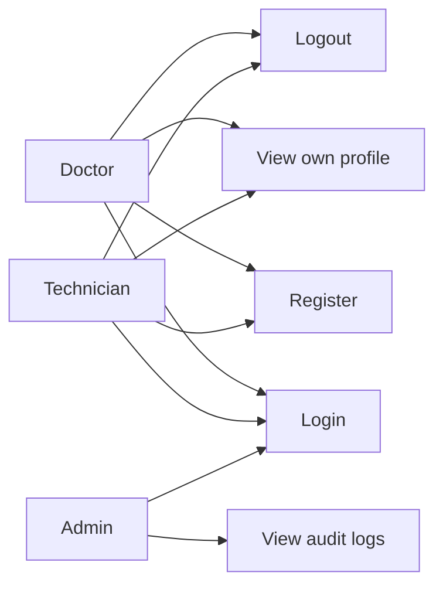

# Functional and Non-Functional Specifications

This document summarizes the Sprint 1 scope and links the app implementation to the product backlog.

## Functional Requirements

- Users can register with email, full name, password, and role.
- Users can log in with email and password.
- Authenticated users can retrieve their profile.
- Authenticated users can log out.
- Admin users can view authentication audit logs.
- Authentication actions are stored in an audit log.

## Non-Functional Requirements

- Passwords must never be stored in plaintext.
- Auth endpoints must return clear errors without exposing sensitive details.
- Audit logs must include timestamp, action, resource, client IP, and user agent.
- Backend code must be testable with `pytest`.
- The app should run locally with Docker Compose.

## Main Use Case Diagram

## Usage Scenarios

### Registration

1. User submits email, full name, password, and role.
2. Backend validates email uniqueness and password length.
3. Backend hashes the password and creates the user.
4. Backend writes an audit log entry.

### Login

1. User submits email and password.
2. Backend verifies credentials.
3. Backend updates `last_login_at`.
4. Backend writes an audit log entry.
5. Backend returns a JWT access token.

### Audit Review

1. Admin logs in.
2. Admin opens the audit log endpoint.
3. Backend verifies admin role.
4. Backend returns recent audit events.

